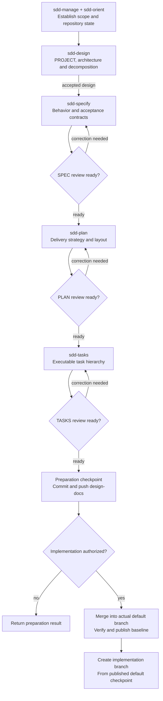
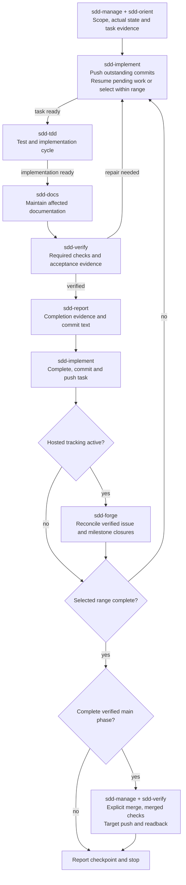
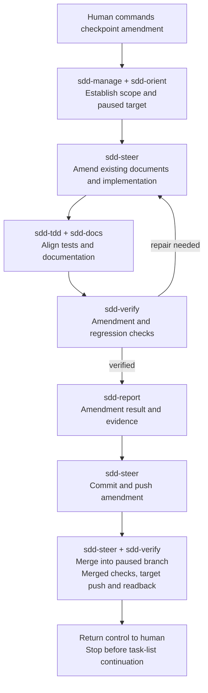
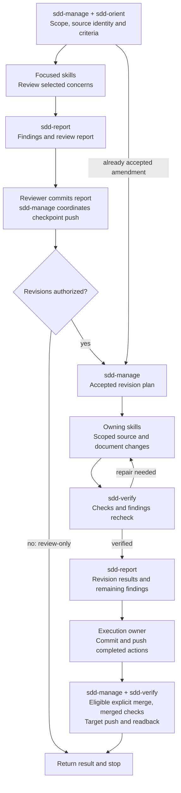

# SDD Manager

**Develop from explicit requirements, implement in bounded steps, and keep the human in control.**

SDD Manager is a learning-by-doing experiment in specification-driven development with coding agents, packaged as an Agent Plugin for Git repositories. Practical project runs inform its refinement; source and local checks establish only their recorded coverage, and installed-client or live acceptance is reported separately. It takes a project from exploration and design through specifications, plans, executable task lists, implementation, and verification. It also supports feature changes, interruption recovery, and focused amendments at implementation checkpoints.

Start with **sdd-manage**, the central coordinator. It routes your request to the relevant skills, reuses established project decisions, and stops at the boundary you specify.

Development uses [SDD Manager](SDD-MANAGER.md). See the [AI-assisted development disclosure](AI_DISCLOSURE.md).

## Getting started

For a new project, copy the [Greenfield Project Prompt Template](<Greenfield Project Prompt Template.md>) and replace its project, repository and token placeholders. SDD Manager supplies the startup procedures and workflow checkpoints.

Load the package using your agent client's supported plugin mechanism. The package uses root `plugin.json` for discovery and presentation, with an identical `.codex-plugin/plugin.json` retained temporarily for legacy ChatGPT/Codex discovery, 15 skills under `skills/` and bundled icons under `assets/`. Manifest paths resolve from the repository/package root. The workflows require an agent with access to project files and the tools needed for the requested work.

- **Project changes:** Use an existing, eligible Git worktree with applicable project instructions. Repository initialization is outside the plugin's scope.
- **First SDD commit:** Ensure a concise root `AGENTS.md` provides current purpose, canonical owners, validated commands and instruction navigation; preserve existing human instructions. Include root `AI_DISCLOSURE.md` and `SDD-MANAGER.md` from the bundled assets, with discoverable README links. Preserve and reconcile existing disclosures. See [repository bootstrap](skills/sdd-manage/references/repository-bootstrap.md) for ownership, explicit scope limits and resumable adoption.
- **Commits and pushes:** Establish the branch and remote destination. Implementation pushes outstanding commits before starting further task work, then commits and pushes each completed task before advancing.
- **Checks:** Use the project's declared test, build, and documentation tools.
- **Authentication:** Attempt pushes with the current shell session. On an access/credential failure, sdd-manage reuses a suitable ignored repository token or requests and saves one beside the root .gitignore before recovering the client session. `*.tkn` files remain untracked.
- **Hosting:** GitHub access is needed only for remote operations. The conventional fine-grained token selects solely the target repository with read/write for Commit statuses, Contents, Issues, Pull requests, and Workflows; Metadata read access is automatic. Add Actions access when required for workflow dispatch or private run inspection. Git and API clients authenticate separately. Local development does not require a hosting token.

Give the coordinator a concrete objective and stopping point. For example:

```text
Use sdd-manage to inspect this repository and prepare the development
specification, plan, layout, and task list for a line-based archive reader.
Use the attached brief as input. Stop before implementation.
```

Once the task list is ready:

```text
Use sdd-manage to implement milestone 1.1 from TASKS.md.
Verify, commit, and push each completed task on its phase branch.
If the phase remains incomplete, pause without merging into main.
Integrate only a complete verified phase, then stop at my requested boundary.
```

Use the milestone and task IDs from your actual task list. You can start at a later stage when its inputs are already established; the coordinator does not repeat earlier stages by default.

## Plugin package

The package includes root `plugin.json`, its temporary legacy compatibility copy `.codex-plugin/plugin.json`, root `README.md`, `AGENTS.md`, `Greenfield Project Prompt Template.md`, `LICENSE`, `SDD-MANAGER.md` and `AI_DISCLOSURE.md`, `skills/`, and `assets/`. Root `plugin.json` is canonical; keep the legacy copy byte-identical when changing metadata or versions. The root manifest preserves the same client metadata; its presence alone does not establish Agent Plugins 1.0 conformance.

Artwork is provided as `assets/icon.svg`, `assets/icon.png`, `assets/logo.svg`, and `assets/logo.png`. Manifest presentation paths use `assets/icon.svg` for the composer icon and `assets/logo.svg` for the logo, including their dark variants. README is user-facing package documentation; runtime workflow instructions live in the skills. Acceptance and development material linked here belongs to the source repository and is outside the pinned skill package.

## Core development workflows

| Workflow | Purpose and typical path |
| --- | --- |
| **Main / greenfield** | Define the complete system, then implement it in bounded increments from design, SPEC, PLAN/layout, and TASKS. Existing projects can enter at an established stage. |
| **Revision** | Correct, simplify, or improve defined/implemented work, typically through the retained review/revision process. A focused accepted prompt can supply the revision objective directly. |
| **Feature** | Add a scoped capability through the necessary feature document package and FEATURE-TASKS, then implement and incorporate accepted deltas within the authorized boundary. |

**Steering is a lightweight revision path** at a paused implementation checkpoint. You command a focused amendment; the agent updates existing documents, code, tests, and documentation without feature overlays or an obligatory formal campaign. It verifies and integrates into the paused branch, then returns control so you decide when to resume.

Main describes the development purpose, not the default Git branch. The [canonical workflow model](skills/sdd-manage/references/workflows.md#core-development-workflows) defines entry and scope; the operations below are stages or supporting work, rather than additional core workflows.

## Workflow diagrams

`sdd-manage` coordinates scope, prerequisites and stopping boundaries; `sdd-orient` establishes actual repository state, including retained work on continuation. The diagrams show common handoffs. Enter at the stage supported by current inputs, use `sdd-conventions` where relevant, and honor explicit user boundaries. A blocker preserves valid work and stops the affected path until resolved.

### Project preparation

Project preparation runs on a dedicated `design-docs/main` or scoped `design-docs/<campaign>-<slug>` branch. Each document owner reviews its artifact against accepted upstream inputs and corrects findings within authorized scope before the next stage. These gates produce adjacent review reports, rather than separate implementation tasks.



Preparation-only stops after the design-docs checkpoint. Before creating a dependent implementation branch, SDD Manager explicitly merges accepted project preparation into the actual default branch, verifies and publishes the merge, and confirms containment. Campaign plans and reports stay on their revision branch. See [preparation integration](skills/sdd-manage/references/branch-management.md#preparation-integration-gate) and [document QC gates](skills/sdd-manage/references/document-qc-gates.md).

### Implementation and continuation

This diagram shows bounded main-phase task execution. `sdd-implement` owns production changes, completion, commits and pushes; supporting skills supply tests, documentation, verification and report text. With hosted tracking enabled, `sdd-manage` and `sdd-forge` establish the eligible phase and task associations before its first task. The optional hosted path below shows completion reconciliation.



Milestone and phase review/report tasks run through the same cycle and supply their required code review, testing and exit evidence. An incomplete phase pushes and pauses. A request covering another phase continues only after verified integration/publication, from the updated target. Feature task execution reuses the cycle, with required accepted-document incorporation through `sdd-integrate-feature` before final boundary verification; feature and revision integration use their own eligibility gates. See [implementation](skills/sdd-implement/SKILL.md) and [Git workflows](skills/sdd-manage/references/git-workflows.md).

### Checkpoint steering

The human commands an amendment at a paused implementation checkpoint. `sdd-steer` owns changes to the affected existing documents and implementation, including persistence and integration into that paused branch.



An assessment-only request returns impact without taking the amendment path. Successful steering does not resume implementation automatically. See [steering](skills/sdd-steer/SKILL.md).

### Review and revision

Focused owners assess the selected concerns; `sdd-report` composes the evidence. Source changes require revision authorization. An already accepted amendment can enter revision planning directly.



Systematic reviews use a review plan; focused requests can supply the criteria directly. Repeat report checkpoints or revision actions as scoped, publishing each completed unit before dependent work. Reviewer assessment ends at its report commit; the encompassing workflow includes publication. Host automatic review has separate ownership and is not a skill handoff in these diagrams. See [review and revision](skills/sdd-manage/references/review-and-revision.md).

## Operations

| Objective | Example request | Result |
| --- | --- | --- |
| Explore and prepare a project | “Compare approaches, then prepare the project through TASKS.” | Accepted design, behavior, delivery strategy, physical ownership, and executable tasks. |
| Prepare a feature | “Define ZIP support and its feature task list.” | Scoped requirements and the necessary feature design, plan, and tasks. |
| Implement a range | “Implement the next three tasks and stop.” | Verified task commits on the phase/feature branch; incomplete phases pause, while eligible complete boundaries explicitly integrate and publish. |
| Resume interrupted work | “Resume milestone 2.2 without discarding pending work.” | Existing work inspected and continued before new tasks are selected. |
| Amend at a checkpoint | “Remove encrypted streams from the implemented scope, including tests and documentation.” | Verified amendment explicitly merged into the paused implementation branch, published, then control returned to the human. |
| Integrate an accepted feature | “Incorporate FEATURE-SPEC into SPEC only.” | Selected main documents reconciled without unrelated task-list changes. |
| Review and revise a project | “Plan a systematic review,” “Review this protocol,” or “Implement accepted findings.” | Retained campaign plans/reports, stable findings, and authorized verified revisions incorporated into governing documents. |
| Review or maintain a scope | “Review PLAN,” “Verify this phase,” or “Align README.” | Findings, evidence, or the explicitly requested maintenance. |
| Collect release highlights | “Summarize key changes since the latest release; update the draft incrementally.” | Provider-independent Git range, curated ignored YAML draft and body-only release notes; no hosting access or publication required. |
| Prepare release packaging | “Verify this ZIP and prepare a workflow that builds it.” | Assessed package contents, stable asset names, build/checksum procedure and verified workflow preparation; interactive development when needed. |
| Create a GitHub release | “Create release v1.2.3 from the verified commit using the configured packages.” | One publisher, complete assets, release state/readback and applicable stable download URLs; actual CI/download verification limits. |
| Synchronize GitHub tracking | “Create issues and milestones for these tasks.” | Phase labels, milestones, task issues, and verified task associations. |

Preparation and review stop before implementation unless your request includes it. Steering finishes the amendment and returns control to you; you separately decide when to resume the task list. Transferring feature tasks into the main task list requires both lists in scope so each task retains one executable owner.

For detailed entry conditions and stopping rules, see the [workflow catalog](skills/sdd-manage/references/workflows.md).

### Release packages and commands

Use [Git release highlights](skills/sdd-forge/references/release-highlights.md) to collect complete commit messages since the selected release tag, including merged work, and curate key user changes. The default ignored `.release-highlights.md` draft records the previous release commit and last analyzed commit in YAML; incremental updates preserve edits and cuts. Release preparation refreshes it through the exact source and passes only its Markdown body to the publisher. An ignored draft requires explicit CI notes transfer; cleanup follows verified published-body consumption. Local preparation works before provider selection and needs no token.

Use [package preparation](skills/sdd-forge/references/github-packaging.md) for archive contents and conventional variant names, [release workflows](skills/sdd-forge/references/github-release-workflows.md) to prepare/dispatch a build, and [release creation](skills/sdd-forge/references/github-releases.md) to publish verified assets. Filenames remain version-free, for example `project.zip` or `project-windows-x64.zip`; tags and release metadata retain version identity. Stable downloads use `https://github.com/{OWNER}/{REPO}/releases/latest/download/{ASSET_NAME}`. Each latest stable release must contain the complete advertised asset set.

Preparing a workflow does not itself publish a product release. Release requests can use the existing workflow or verified local packages through supported GitHub CLI/API operations. The references include `gh workflow run` and draft/upload/publish command recipes. No task tracking activation is required. [Release checks](skills/sdd-verify/references/release-checks.md) and [reporting](skills/sdd-report/references/releases.md) distinguish local build, CI execution, hosted metadata and downloaded-byte verification.

## Branches and integration

Work on a scoped branch for the selected range, feature, steering amendment, or document integration. Establish its target and starting checkpoint; the target need not be the default branch. Reuse the branch when continuing the same work.

- **Task checkpoints:** Commit and push each completed task before advancing.
- **Preparation baseline:** Commit project design, SPEC, PLAN/layout, TASKS, feature counterparts and their QC reports on design-docs. Explicitly merge, verify and publish accepted preparation into the actual default branch before creating a dependent implementation branch from that checkpoint. Preparation-only stops on design-docs; a failed merge or publication blocks branch creation.
- **Default publication:** Use the repository's actual default branch name, commonly `main` or `master`. Push the verified preparation merge there before creating implementation branches; carry the established request scope and verification through the publication handoff.
- **Phase boundary:** Main development uses `phase/<number>-<slug>`. Task/milestone subsets push and pause; complete verified phases explicitly merge into the established main integration branch. An authorized next phase starts from the updated published main tip.
- **Revision and feature boundaries:** Use `revision/<campaign>-<slug>` or `feature/<campaign>-<slug>`, matching the artifact identity. Eligible coherent boundaries integrate with `git merge --no-ff`, merged-state verification, and target publication.
- **Campaign records:** Author review/revision plans and reports on the campaign revision branch. They do not need a preliminary design-docs/default merge. A revision with separate project preparation keeps these branch roles distinct and incorporates the published project baseline before dependent source work.
- **Feature documents:** Incorporate selected accepted deltas on the feature branch before final verification and merge. A narrow request does not authorize unfinished feature work or unselected document changes.
- **Steering:** Branch from the paused implementation checkpoint and merge back there. A blocked amendment retains its work and resumes on a human command; successful steering still does not resume the main task list.
- **Failures:** Preserve valid work and report conflicts, required-check failures, or pending target publication. No automatic rollback or force-push. Separate worktrees can protect unrelated dirty work.

General revision records live under `docs/dev/reviews/<campaign>-<slug>/`; checkpoint steering records live under `docs/dev/reports/phases/<phase-id>/revisions/<campaign>-<slug>/`; feature identity/navigation and completed incorporated sources live under `docs/dev/features/<campaign>-<slug>/`. Reviews, steering revisions and features use one repository-wide sequence and stable starting-SHA identity. Active feature files remain in docs/dev until safely incorporated and archived; historical task snapshots are not executable owners. Main governing documents remain in docs/dev. Explicit project/user overrides and suitable legacy branches are preserved.

See [branch management](skills/sdd-manage/references/branch-management.md) for naming/setup/phase transitions and the [Git workflow](skills/sdd-manage/references/git-workflows.md) for branch reuse, interruption, merge verification, and publication. Git merge and feature-document incorporation have distinct owners; hosted PR operations remain outside the current backend.

## Review and revision records

Closed review, revision, steering and feature packages are historical artifacts within their own campaign context. They remain unchanged and need not stay valid after later changes. Routine work does not load, validate, repair or report their historical compatibility; consult only relevant records/sections when the current task specifically needs them. Finish archive/navigation/report updates before campaign closure, and maintain current main documents in later campaigns. See [closed campaign records](skills/sdd-conventions/references/review-campaigns.md#closed-campaign-records).

Use `docs/dev/reviews/<sequence>_<baseline-sha>-<slug>/` for a general campaign (phase-checkpoint steering uses its phase-specific revisions prefix): review plan → review → review report → revision plan → revision → revision report. A focused review can start directly from a prompt and record its scope/criteria in REVIEW-REPORT. A comprehensive review plans units and report checkpoints first.

Each planned review unit ends with its report commit. The coordinating workflow publishes that checkpoint before dependent work; pushes remain part of the complete workflow. Host automatic tool review has separate ownership from plugin content review. Full revision and implementation workflows include their prescribed pushes under the existing scoped authorization. Accepted revisions update relevant governing documents; all campaign records remain retained. Directory identity stays fixed as HEAD advances. **sdd-report** supplies scalable artifact templates, and **sdd-manage** coordinates scope and execution.

## ChatGPT website approvals and host automatic review

In ChatGPT web, the user observed these controls in **Profile → Settings → Integrations → Cloud computer** during the October 2026 run. UI locations and labels may differ by client/version. OpenAI's [Cloud browser documentation](https://help.openai.com/en/articles/20001280-using-cloud-browser-in-chatgpt) describes **Settings → Cloud browser**, website approval modes and site-specific permissions.

A narrower website-access configuration is **ChatGPT Work website approvals → Auto approve**, with **Add website → GitHub → Always allow**. A broader alternative is **Always allow** as the main website policy. The documented Auto approve mode still reviews website destinations; site-specific permissions override the general website setting. Consequential actions may have separate confirmation requirements. These options describe browser website access, not a guarantee that Git pushes or other shell/API requests will avoid sandbox automatic review.

Host review is separate from SDD Manager content review. The observed website settings' effect on shell/API requests is unverified. Retain blocked work and report actual publication state through [Git recovery](skills/sdd-manage/references/git-workflows.md#platform-authorization-rejection); distinguish authentication failures through [credential recovery](skills/sdd-manage/references/credentials.md). Changing account settings is a human choice, not an acceptance-run prerequisite.

## Testing with TextStats

[TextStats](acceptance/textstats/README.md) exercises the plugin through fresh consumer workflows and independent assessments in a dedicated test repository. Its README describes setup, required variants, optional complex recovery, retained evidence and final integration into test main. Support tests check the harness; they do not establish live acceptance of a revised source.

Prior test repositories (retain this list when adding runs):

- [Skill-Test-SDD-Manager-TextStats-20261003](https://github.com/pchemguy/Skill-Test-SDD-Manager-TextStats-20261003)
- [Skill-Test-SDD-Manager-TextStats-20261004](https://github.com/pchemguy/Skill-Test-SDD-Manager-TextStats-20261004)

Repository names are history, not default destinations or acceptance verdicts. The [20261004 diagnostic](docs/dev/reviews/021_85f2857/DIAGNOSTIC-REPORT.md) retains **20 Passed / seven Blocked** for pinned 0.14.3; its evidence was subsequently merged into test main. [Campaign 021](docs/dev/reviews/021_85f2857/REVISION-REPORT.md) implements the resulting harness/documentation amendments. Revised-source live and installed-client acceptance remain separately pending.

## Skills

The coordinator handles workflow selection and shared prerequisites. Focused skills own the work within each stage.

| Skill | Responsibility |
| --- | --- |
| [sdd-manage](skills/sdd-manage/SKILL.md) | Coordinate scope, prerequisites, branches, explicit integration, credentials, and stopping points. |
| [sdd-orient](skills/sdd-orient/SKILL.md) | Inspect instructions, repository state, documents, tooling, and interrupted work. |
| [sdd-conventions](skills/sdd-conventions/SKILL.md) | Apply shared design, modularity, and task-hierarchy criteria. |
| [sdd-design](skills/sdd-design/SKILL.md) | Explore the problem; develop the project brief, architecture, and decomposition. |
| [sdd-specify](skills/sdd-specify/SKILL.md) | Define observable behavior, contracts, and acceptance conditions. |
| [sdd-plan](skills/sdd-plan/SKILL.md) | Define delivery strategy, milestones, exit conditions, and physical layout. |
| [sdd-tasks](skills/sdd-tasks/SKILL.md) | Derive task lists and review their structure, dependencies, and progress evidence. |
| [sdd-implement](skills/sdd-implement/SKILL.md) | Select executable ranges; implement or resume tasks; verify, commit, and push. |
| [sdd-steer](skills/sdd-steer/SKILL.md) | Apply a focused human-directed amendment at a checkpoint, then stop. |
| [sdd-integrate-feature](skills/sdd-integrate-feature/SKILL.md) | Incorporate accepted feature deltas and reconcile selected task lists. |
| [sdd-tdd](skills/sdd-tdd/SKILL.md) | Develop testing strategy, write meaningful tests, and guide test-first implementation. |
| [sdd-verify](skills/sdd-verify/SKILL.md) | Run the required checks and assess acceptance evidence, failures, and gaps. |
| [sdd-docs](skills/sdd-docs/SKILL.md) | Maintain professional module/API documentation, README, guides, and examples. |
| [sdd-report](skills/sdd-report/SKILL.md) | Draft issues, commit messages, PR descriptions, and evidence-backed progress reports. |
| [sdd-forge](skills/sdd-forge/SKILL.md) | Prepare shared Git release highlights and coordinate GitHub task tracking, packages/workflows and verified releases. |

## Development-document quality gates

Completed SPEC is reviewed against accepted PROJECT/design before PLAN; PLAN and relevant layout are reviewed against SPEC before TASKS; TASKS is reviewed against PLAN before implementation or hosted projection. Authoring includes scoped correction/recheck and an adjacent `SPEC-REVIEW-REPORT.md`, `PLAN-REVIEW-REPORT.md` or `TASKS-REVIEW-REPORT.md` (feature counterparts beside their roots). Confirmed unresolved issues block dependent progression. Reports retain original findings and append Revision N correction/recheck evidence; read-only review does not authorize repairs.

Prefer 3–5 delivery milestones per phase and delivery tasks per milestone when the scope supports it. Review 1–2 groups for fragmentation and 10+ for overloading/drift; assess semantic scope in every range. Exclude dedicated review units from delivery counts while retaining their mandatory execution. Justify narrow groups and avoid padding or quota-driven splits. See [shared QC policy](skills/sdd-conventions/references/development-document-qc.md) and [coordinator gates](skills/sdd-manage/references/document-qc-gates.md).

## Development documents

The main documents describe the complete intended project. Task lists record executable work and evidence-backed progress. Roots can link to focused children when a concern needs substantial detail.

| Document under `docs/dev/` | Owns |
| --- | --- |
| `PROJECT.md` | Purpose, users, scope, outcomes, and constraints. |
| `ARCHITECTURE.md` | Major blocks, relationships, dependency direction, and design decisions. |
| `DECOMPOSITION.md` | Component responsibilities, collaborations, and design-level interfaces. |
| `SPEC.md` | Required behavior, final contracts, errors, invariants, and acceptance. |
| `PLAN.md` | Meaningful end-to-end MVP, small capability increments, phases/milestones, dependencies, and verification/decision gates. |
| `layout.md` | Physical ownership of source, tests, documentation, and other artifacts. |
| `TASKS.md` | Phase → Milestone → Task hierarchy, stable IDs, and progress evidence. |

Each delivery milestone ends with an explicit code review/testing/report task. Each phase ends with a dedicated milestone containing one phase review/testing/report task; it runs after delivery milestones close. Main implementation reports live at `docs/dev/reports/phases/<phase-id>/PHASE-REPORT.md` and `<milestone-id>.md` in that same directory; feature reports stay under `docs/dev/features/<feature-id>/`. With hosted tracking active, only the eligible phase is projected before its first task; verified/pushed task issues close before milestone closure. See the [backend lifecycle](skills/sdd-conventions/references/backend-object-lifecycle.md) for gates, ownership, TODO aggregation and recovery.

PLAN defaults to the simplest practical meaningful end-to-end MVP, then grows it through small testable capability increments. Necessary prerequisites are justified; the complete intended design and SPEC remain authoritative. Appropriate milestone demonstrations and functional/usability feedback inform human decisions to continue, amend, simplify, or stop. TASKS supplies bounded work within these increments.

A scoped feature can use `FEATURE_ARCHITECTURE.md`, `FEATURE_DECOMPOSITION.md`, `FEATURE-SPEC.md`, `FEATURE-PLAN.md`, and `FEATURE-TASKS.md` as needed. Accepted deltas are incorporated into the selected main documents through **sdd-integrate-feature**. Checkpoint steering directly amends existing documents and creates no feature-document layer.

## Completion and continuity

- **Evidence determines completion.** A checkbox, passing command, or closed issue alone is insufficient. Implementation checks the task's requirements, tests, documentation, and prescribed verification before recording completion.
- **Existing work is preserved.** Orientation compares task and Git evidence with pending changes. Completed work awaiting commit is persisted without repeating its implementation; dirty state alone does not justify reset.
- **Git provides durable checkpoints.** No transaction journal or recovery directory is required. Commits and task evidence support continuation.
- **Changes remain scoped.** Unrelated staged and unstaged work is preserved. Documentation findings requiring governing-document amendments are returned to the human.
- **Hosting reflects local evidence.** GitHub issues close after verified, committed task completion. Hosting failures remain pending and do not erase local results; task-branch completion is distinct from target integration and publication. Rate limits/outages remain deferred; uncertain writes are reconciled before retrying.

## Package status and references

The backend lifecycle now defines phase-gated hosted creation, dedicated boundary review/report tasks, milestone closure, workflow-specific report placement and interruption reconciliation. [Campaign 010](docs/dev/reviews/010_3f56922/REVISION-REPORT.md) records source and consumer verification; later live evidence and limits are retained in the [20261004 diagnostic](docs/dev/reviews/021_85f2857/DIAGNOSTIC-REPORT.md); revised-source acceptance remains separate.

All 15 skills are included. Structural validation and independent coordination assessments have been exercised. The [runtime acceptance campaign](docs/dev/reviews/008_98a5562/REVISION-REPORT.md) records actual fresh-agent workflows through explicit skill-source loading, live GitHub tracking/publication, and controlled failure/recovery fixtures. Installed-client discovery, routing and activation remain untested; available journals are not complete native transcripts. All 27 scoped cases passed independent assessment; source integration is recorded in the campaign report.

- [TextStats acceptance test project](acceptance/textstats/README.md): portable coordinator entry, sample contracts, case inputs, independent assessment and interruption recovery.
- [Capability map](docs/dev/CAPABILITY-MAP.md): artifact ownership and cross-skill boundaries.
- [Review campaigns](docs/dev/reviews/README.md): ordered review and revision records.
- [Revision evidence](docs/dev/reviews/003_39374c8/REVISION-REPORT.md): branch workflows, failure handling, fresh-session execution, and validation limits.
- [Plugin review](docs/dev/reviews/001_49143fa/REVIEW-REPORT.md): findings, corrections, verification evidence, and limits.
- [TDD provenance](skills/sdd-tdd/references/upstream-provenance.md): adaptation of Superpowers TDD and its test-writing companion, with the retained MIT license.


## License

SDD Manager is licensed under the [MIT License](LICENSE). Bundled third-party material retains its own license and attribution, including [the TDD adaptation license](skills/sdd-tdd/LICENSE).

## Related projects

[GitHub Spec Kit](https://github.com/github/spec-kit) provides structured workflows and reusable assets for coding agents. [Superpowers](https://github.com/obra/superpowers) presents a development methodology built from composable skills. These are related reading for users exploring agent-assisted development; they are not dependencies, endorsements or claims of derivation.
